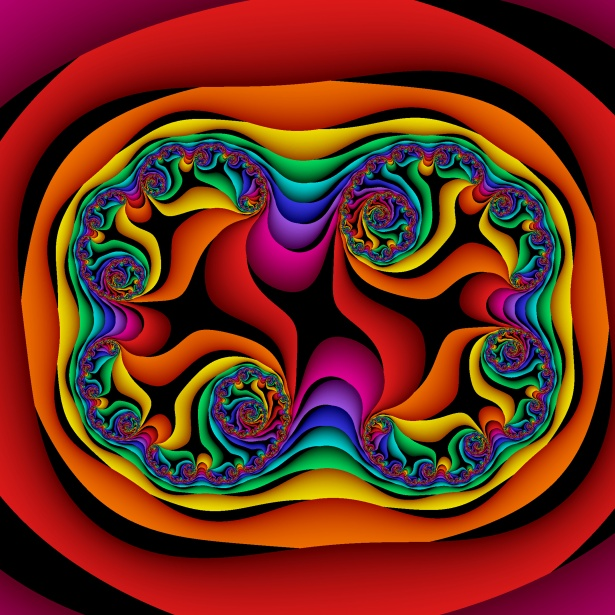
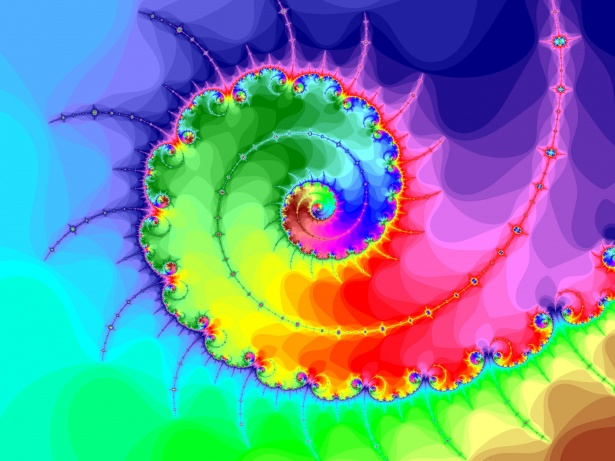
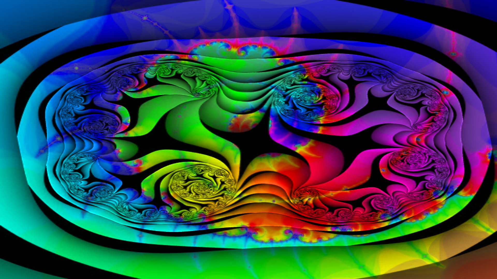

# Image Channel Mixer
Combine the channels (red, blue, green, hue, saturation, luminance etc.) of multiple images into one image.

## Example

`image_channel_mixer hsl --hf fractal-2.jpg --hc h --sf fractal-2.jpg --sc s --lf fractal-1.jpg --lc l -o output.png`

This commands gets the luminance (shading) from  fractal-1.jpg and the hue and saturation from fractal-2.jpg to make output.png.

### fractal-1.jpg

### fractal-2.jpg

### output.png

